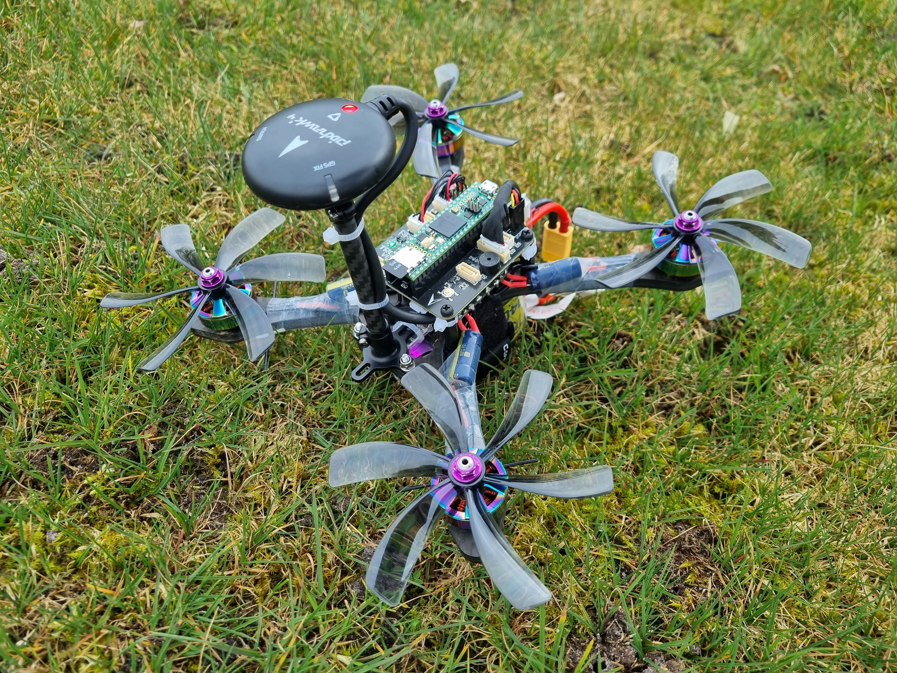

# PX4 Autopilot

PX4 is an open-source BSD-3 Licensed autopilot system for unmanned aerial vehicles (UAVs) It provides both hardware and software components to control various types of drones, from small quadcopters to fixed-wing aircraft and even autonomous vehicles like rovers and boats.

# Tropic VMU PX4 Known Issues 

Some PX4 features aren **not** fully integrated and are still work-in-progress.
 
- PWM_4 Doesn't support DShot, however PWM_1, PWM_2, PWM_3, PWM_5 and PWM_6 do work fine.
  - PWM_4 uses FlexIO2 instead of FlexIO1, needs driver modification for it to work.

# Serial port mapping

| UART    | Device     | Port  |
|---------|------------|-------|
| LPUART5 | /dev/ttyS0 | DEBUG |
| LPUART3 | /dev/ttyS2 | TELEM |
| LPUART2 | /dev/ttyS1 | GPS   |
| LPUART4 | /dev/ttyS3 | AUX   |
| LPUART8 | /dev/ttyS4 | RC    |

# Building PX4 for Tropic

First you need to setup your build environment. The PX4 user guide provides a [Developer Environment guide](https://docs.px4.io/main/en/dev_setup/dev_env.html). There you can select the corresponding guide for your platform, [Ubuntu](https://docs.px4.io/main/en/dev_setup/dev_env_linux_ubuntu.html), [Windows](https://docs.px4.io/main/en/dev_setup/dev_env_windows_wsl.html), [macOS](https://docs.px4.io/main/en/dev_setup/dev_env_mac.html).

After setting up your build environment enter the `PX4-Autopilot` folder and type the following command to build PX4
```
make nxp_tropic
```

# Flashing the board

The Teensy comes with it's own bootloader, allowing to flash PX4 through USB.
Teensy provides a Teensy Loader gui flashing for more information checkout [this guide](https://www.pjrc.com/teensy/loader.html). The file you want to flash is located under `PX4-Autopilot/build/nxp_tropic_default/nxp_tropic_default.hex`


On Linux you can also flash PX4 directly from the `make` build system.
Make sure to install the `teensy-loader-cli` application first.
On a Ubuntu based system you can use the following command

```
sudo apt install teensy-loader-cli
```

Connect the board through USB and then press the physical button on the Teensy to put it into bootloader mode.

Flashing the board is simply done by the command below

```
make nxp_tropic upload_teensy
```

A succesfull flash should like like this.

```
peter@desktop-peter:~/src/firmware$ make nxp_tropic upload_teensy
[0/1] uploading px4
Found teensy bootloader
Teensy Loader, Command Line, Version 2.2
Read "/home/peter/src/PX4-Autopilot/build/nxp_tropic_default/nxp_tropic_default.hex": 1809658 bytes, 22.3% usage
Found HalfKay Bootloader
Programming........................................................................................
Booting
peter@desktop-peter:~/src/PX4-Autopilot$
```

# QGroundControl

Once PX4 has been flashed on the Tropic VMU, Connect the Tropic VMU to your PC through USB and launch [QGroundControl](http://qgroundcontrol.com/) to configure your Tropic VMU.

For more information on how to configure PX4 checkout the [PX4 configuration guide](https://docs.px4.io/main/en/config/)

# PX4 Tropic VMU rev. A test

The first revision of the Tropic VMU rev.A has been tested with PX4 has been tested on a small quad in autonomous flight.



## PX4 Testing Flight Logs:
1. https://logs.px4.io/plot_app?log=9d5c333c-3806-461c-9c77-20e4f58b2683
2. https://logs.px4.io/plot_app?log=161a0efc-d6a4-471e-990d-6fe45f177ba8
