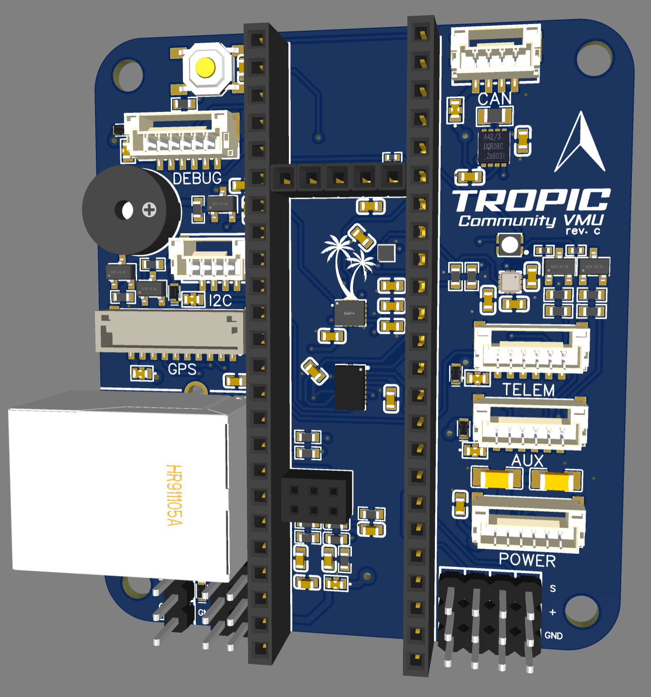

# Tropic Community VMU

Tropic Community VMU (Vehicle Management Unit) is an BSD-3 Licensed Open-Source base board designed around the [Teensy 4.1 Development board](https://www.pjrc.com/store/teensy41.html).

> [!NOTE]  
> Tropic VMU is a project created by a group of passionate individuals who work on it in their free time. It's important for users to understand that Tropic might not provide the same reliability, features, or support as products from well-established companies. Using Tropic is entirely up to the user's discretion and comes with its own risks.
> 
> For a more dependable and professional VMU, we suggest looking into the NXP reference based on Dronecode Pixhawk standard V6X-RT (p/n MR-VMU-RT1176). The NXP V6X-RT offers advanced features, some level of support across multiple autopilots, and is designed towards the needs of professional users, providing a more reliable solution for their requirements.

Tropic Community VMU is capable of running autopilot software for unmanned vehicles such as:
 - Drones
 - Rovers
 - Boats
 - And more

## Drone Test flight Video

# Software

The Tropic Community VMU supports multiple Autopilots, please check the individual guide below

 - [Cognipilot setup guide](./Cognipilot.md)
 - [PX4 Autopilot setup guide](./PX4_Autopilot.md)

Tropic VMU also supports Zephyr RTOS with most of it's peripherals enabled.

> [!NOTE]  
> We're still in the process of upstreaming code please check the open pull requests in the corresponding projects

# Hardware

Tropic Community VMU utilizes the Teensy 4.1 consisting of:

- NXP MIMXRT1062DVJ6B MCU
- Cortex-M7 600MHz
- 1024K RAM (512 Tightly coupled)
- 8MB Flash
- 100Mbps Ethernet
- USB HS 480Mbit/s
- SD Card interface

Tropic Base board consisting of:

- Bosch BMI088 IMU
- Bosch BMM150 Magnetometer 
- Bosch BMP388 Barometer
- TDK InvenSense ICM-42688-P IMU
- NXP TJA1051TK CAN Transceiver
- RGB Led
- Buzzer
- Button

With connectors for:

- 10-pin JST-GH GPS connector
- 6-pin JST-GH UART + Handshake connector
- 6-pin JST-GH AUX Multi-function connector
    - UART
    - Quadrature decoder
    - PWM
    - Crossbar trigger
- 6-pin JST-GH Power module connector
    - [Tropic Power module](./tropic_power_module.md)
    - [Holybro PM02](https://holybro.com/products/pm02-v3-12s-power-module)
    - [Aliexpress PM06](https://nl.aliexpress.com/item/1005003265592048.html?spm=a2g0o.productlist.main.57.5d7bUbAWUbAWRJ&algo_pvid=a921d23b-9f8c-424d-91c9-7d8407cadea6&algo_exp_id=a921d23b-9f8c-424d-91c9-7d8407cadea6-28&pdp_npi=4%40dis%21EUR%2113.96%219.78%21%21%2114.68%2110.28%21%402103896117081946544951477ef06f%2112000024928023880%21sea%21NL%21919188679%21&curPageLogUid=gQjCeaENMPHX&utparam-url=scene%3Asearch%7Cquery_from%3A)
- 6-pin JST-GH Debug UART connector providing system console
- 4-pin JST-GH I2C connector
- 4-pin JST-GH CAN bus connector
- 3-pin DuPont for Digital Receiver i.e. SBUS
- 6x 3-pin DuPont PWM header (DShot capable)
- RJ45 Ethernet connector

Some of the JST-GH connectors pinout follows the [DS-009 connector specification](https://github.com/pixhawk/Pixhawk-Standards/blob/master/DS-009%20Pixhawk%20Connector%20Standard.pdf)

# Powering the board

The Tropic Community VMU can be powered in 2 ways

> [!WARNING]  
> You should only power the Tropic Community VMU through either method 1. or 2. For example the current can flow from the power module to your usb potentially damaging your machine.
> You should to cut the power pad on the Teensy as a precaution if you want to use USB and the Power-module simultaneously, but by doing so you would lose the ability to power the board through USB.
> For more information see [Teensy External Power](https://www.pjrc.com/teensy/external_power.html) guide.

1. Through the micro-USB port on the Teensy 4.1
2. Through a 6-pin JST-GH power module

# Pinout

| Teensy Pin | Label        | IMXRT Label | Peripheral      | Alternative mode |
|------------|--------------|-------------|-----------------|------------------|
| 35         | TX DEBUG     | B1_12       | LPUART5         |                  |
| 34         | RX DEBUG     | B1_13       | LPUART5         |                  |
| 17         | TX TELEM     | AD_B1_06    | LPUART3         |                  |
| 16         | RX TELEM     | AD_B1_07    | LPUART3         |                  |
| 41         | TELEM RTS    | AD_B1_05    | LPUART3         | GPIO1_IO21       |
| 40         | TELEM CTS    | AD_B1_04    | LPUART3         | GPIO1_IO20       |
| 14         | TX GPS       | AD_B1_03    | LPUART2         |                  |
| 15         | RX GPS       | AD_B1_02    | LPUART2         |                  |
| 8          | TX AUX       | B1_00       | LPUART4         | XBAR1_XBAR_IN14  |
| 7          | RX AUX       | B1_01       | LPUART4         | XBAR1_XBAR_IN15  |
| 20         | RC           | AD_B1_10    | LPUART8         |                  |
| 19         | EXT_SCL      | AD_B1_00    | LPI2C1          |                  |
| 18         | EXT_SDA      | AD_B1_01    | LPI2C1          |                  |
| 24         | BARO_MAG_SCL | AD_B0_12    | LPI2C4          |                  |
| 25         | BARO_MAG_SDA | AD_B0_13    | LPI2C4          |                  |
| 27         | SPI2_SCK     | AD_B1_15    | LPSPI3          |                  |
| 26         | SPI2_MOSI    | AD_B1_14    | LPSPI3          |                  |
| 39         | SPI2_MISO    | AD_B1_13    | LPSPI3          |                  |
| 38         | SPI2_CS      | AD_B1_12    | LPSPI3          | GPIO1_IO28       |
| 28         | DRDY         | EMC_32      | LPSPI3          | GPIO3_IO18       |
| 13         | SPI1_SCK     | B0_03       | LPSPI4          |                  |
| 11         | SPI1_MOSI    | B0_02       | LPSPI4          |                  |
| 12         | SPI1_MISO    | B0_01       | LPSPI4          |                  |
| 10         | SPI1_CS      | B0_00       | LPSPI4          | GPIO2_IO00       |
| 36         | SPI1_CS2     | B1_02       | LPSPI4          | GPIO2_IO18       |
| 23         | BMI DRDY     | AD_B1_09    | LPSPI4          | GPIO1_IO25       |
| 6          | BMI DRDY2    | B0_10       | LPSPI4          | GPIO2_IO10       |
| 4          | PWM_1        | EMC_06      | FLEXPWM2_PWMA00 | FLEXIO1_FLEXIO06 |
| 33         | PWM_2        | EMC_07      | FLEXPWM2_PWMB00 | FLEXIO1_FLEXIO07 |
| 5          | PWM_3        | EMC_08      | FLEXPWM2_PWMA01 | FLEXIO1_FLEXIO08 |
| 9          | PWM_4        | B0_11       | FLEXPWM2_PWMB02 | FLEXIO2_FLEXIO11 |
| 2          | PWM_5        | EMC_04      | FLEXPWM4_PWMA02 | FLEXIO1_FLEXIO04 |
| 3          | PWM_6        | EMC_05      | FLEXPWM4_PWMB02 | FLEXIO1_FLEXIO05 |
| 0          | LED_R        | AD_B0_02    | XBAR1_XBAR_IN16 | GPIO1_IO02       |
| 1          | LED_B        | AD_B0_03    | XBAR1_XBAR_IN17 | GPIO1_IO03       |
| 37         | LED_G        | B1_03       | FLEXPWM2_PWMB03 | GPIO2_IO19       |
| 29         | BUZZER       | EMC_31      | FLEXPWM3_PWMA01 | GPIO4_IO31       |
| 32         | ARM          | B0_12       | GPIO            | GPIO2_IO12       |
| 22         | ADC_V        | AD_B1_08    | ADC1_IN13       | GPIO1_IO27       |
| 21         | ADC_A        | AD_B1_11    | ADC1_IN0        | GPIO1_IO24       |

# Open-source hardware Design

Tropic Community VMU design is licensed under BSD-3 and all design files are published on this git.

## Schematics
[Tropic Community VMU rev.C schematics](./schematics/Schematic_Tropic-VMU_2024-05-31_revC.pdf)

## PCB Design

The board is designed using [EasyEda Std Edition](https://easyeda.com/editor), to import the project you've to create a new project in EasyEda Std edition and select File -> Open -> EasyEda and select the json files available in the zip file.

[Tropic Community VMU rev.C EasyEda zip file](./board/tropic_vmu_easyeda_revc.zip)

## Bill-of-Material (BOM)

Click here for the [BOM](./BOM.md)

## Production files

These are the [production files](./board/tropic_vmu_production_files_revc.zip) used for rev.C of tropic

## Printable models/parts

For 3d-printed enclosures and parts checkout the [Printable models/parts](./printable_models.md) page

## Advanced topics

Some advanced topics regarding Ethernet, RTC and AUX port are explained [here](./advanced_topics.md)
