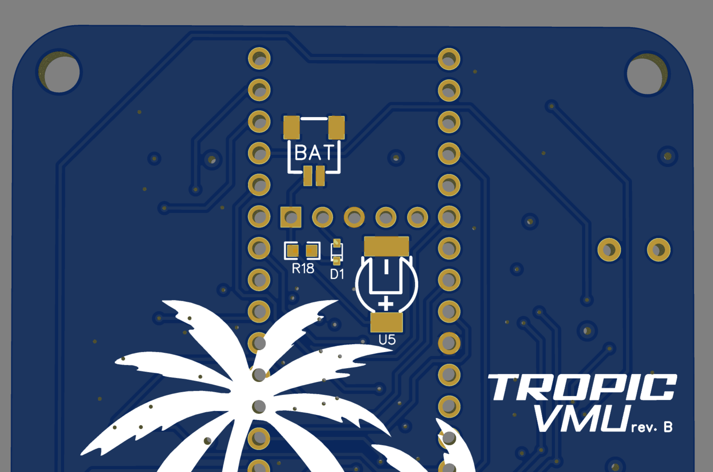

# Tropic VMU Advanced Topics

This page describes various topics for advanced users.

# Ethernet

> [!WARNING]  
> For those with a Tropic VMU rev.B baseboard the RJ45 is non-fuctional, please use rev.C or later for ethernet

## Ethernet 3x2 Socket + Pins

The ethernet board-to-board connection is a 3x2 socket with a 2mm pitch. Conventional 2x3 2mm pitch female headers should work fine but male headers have to be taller (~ 8.5mm) [PJRC provides Pins & Sockets](https://www.pjrc.com/store/header_socket_3x2.html) with the correct size.

As alternative you can also get these Pins from a distributor: \
Samtec MTMM-103-10-T-D-355

Or these sockets: \
TE 2314820-6 \
BOOMELE(Boom Precision Elec) 2.0-2*3P 

# Real-time Clock (RTC) Circuitry

A RTC allows you to keep track on time while the Tropic is powered off.
This is done by powering the [VBAT pin](https://www.pjrc.com/store/teensy41.html#power) on the Teensy with a battery which allows the Tropic to keep track of time without power.

The Tropic baseboard allows to 3 ways to power VBAT.
- The combination of D1 and R18 are used to provide an adjustable trickle charge to a supercap or rechargeable battery
1. **SuperCap**: By placing a supercap (DSK-3R3H703T414-HRL) on U5, diode (PMEG4002EB) on D1 and a 300Ω resistor on R18
   
2. **Rechargeable Battery**: An external ML2020 rechargeable battery connected with a JST-SH connector for example the [Raspberry Pi RTC battery](https://www.raspberrypi.com/products/rtc-battery/). By placing a JST-SH 2-pin connector (SM02B-SRSS-TB (LF)(SN)) on BAT, diode (BAT43XV2) on D1 and a 300Ω resistor on R18.
  
3. **Primary Lithium Cell**: An external CR2032 battery, By placing a JST-SH 2-pin connector (SM02B-SRSS-TB (LF)(SN)) on BAT, do not populate R18 and D1.

# AUX Port

The AUX port is a 6-pin JST-GH Multi-function connector capable of the following configurations:
- 1x UART using pin 2,3 and with pin4,5 claimed by RGB led
- 2x UART
- 1x UART with GPIO Handshaking
- Quadrature decoder
- 4x PWM
- Crossbar trigger

JST-GH 6-pin pinout:

| JST-GH Pin | Label        | IMXRT Label |
|------------|--------------|-------------|
| 1          | 5V           | -           |
| 2          | TX AUX       | B1_00       |
| 3          | RX AUX       | B1_01       |
| 4          | LED_R        | AD_B0_02    |
| 5          | LED_B        | AD_B0_03    |
| 6          | GND          | -           |

> [!NOTE]  
> Pin 4,5 on the AUX connector are shared with LED_R and LED_B from the RGB Led, you can only use either at the same time

This table shows the alternative MCU(Teensy Pin) functions available on AUX Port pins 2,3,4,5 above.

| Teensy Pin | Label        | IMXRT Label | Primary Mode    | Alternative modes |
|------------|--------------|-------------|-----------------|------------------|
| 8          | TX AUX       | B1_00       | LPUART4_TX      | FLEXPWM1_PWMA03, XBAR1_XBAR_IN14, GPIO2_IO16  |
| 7          | RX AUX       | B1_01       | LPUART4_RX      | FLEXPWM1_PWMB03, XBAR1_XBAR_IN15, GPIO2_IO17  |
| 0          | LED_R        | AD_B0_02    | XBAR1_XBAR_IN16 | LPUART6_TX, XBAR1_XBAR_IN16, GPIO1_IO02 |
| 1          | LED_B        | AD_B0_03    | XBAR1_XBAR_IN17 | LPUART6_RX, XBAR1_XBAR_IN17, GPIO1_IO03 |

## PX4 AUX configuration
In the PX4 the AUX connector is configured by default to be a single UART with LED_R, LED_B used for the RGB led. Due note when connecting a 6-pin UART device **you will need to unplug** pin 4 and pin 5 to otherwise your device will receive interference from the RGB led PWM.

# BMP388 End-of-life

The BMP388 Barometer availability is declining due to its EOL status. However the new BMP390 is pin-compatible and should just work fine as a replacement.
