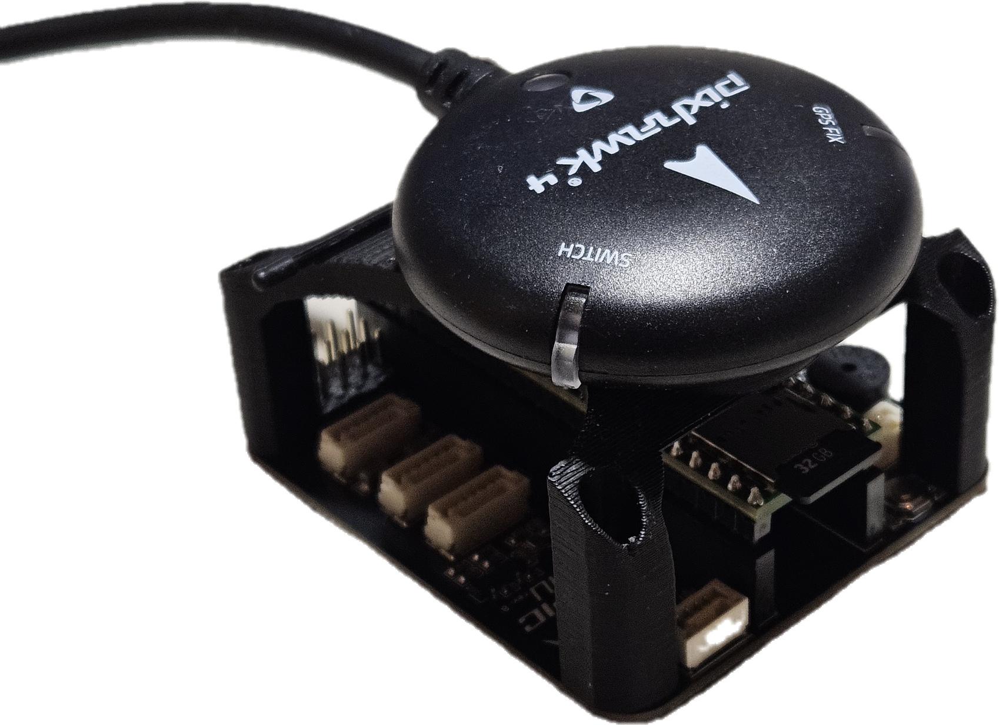
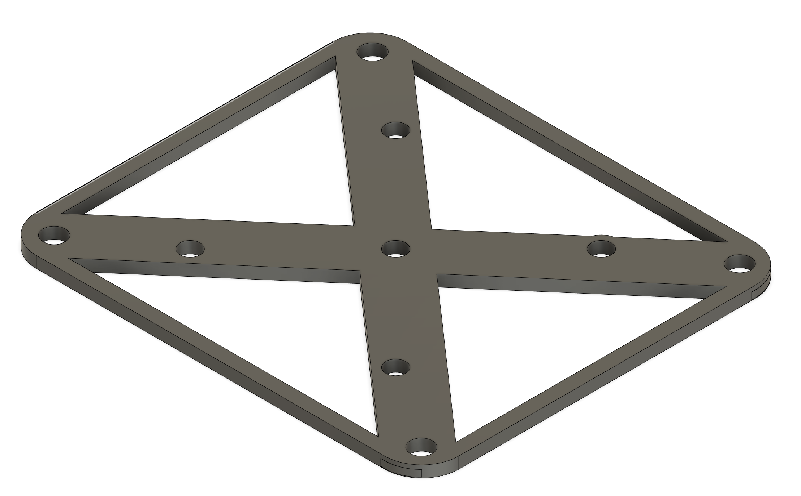

# GPS Mount 

[3d-printed mount](./printable_models/gps_mount.stl) for GPS mounting i.e. [Holybro M10 GPS](https://holybro.com/collections/gps/products/m10-gps)

# Drill Jig

[3d-printed jig](./printable_models/tropic_drill_jig.stl) for drilling the holes matching the Tropic  Community VMU baseboard holes