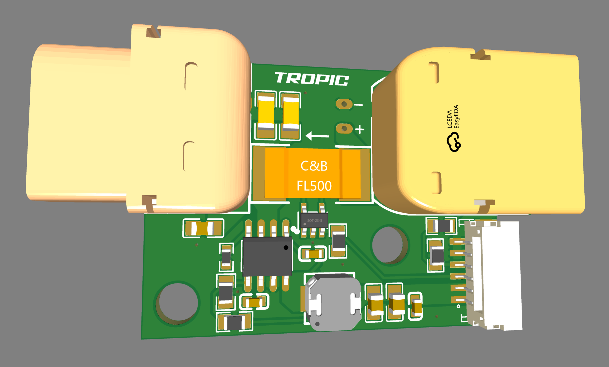

# Tropic Power Module

Tropic Power Module is an BSD-3 Licensed Open-Source board designed for the [Tropic Community VMU (Vehicle Management Unit)](./README.md)
It provides analog measurement of voltage and current which can be used by flight control software to estimate the battery state and/or power consumption.

# Hardware

Tropic Power Module Specification:

- 6.4-36V Input voltage (2S-8S)
- 5.3V Max. 3A output
- Voltage Divider: 18
- Amperes per volt: 38.462A

Power module JST-GH 6-pin pinout:

| JST-GH Pin | Label        |
|------------|--------------|
| 1          | 5V           |
| 2          | 5V           |
| 3          | ADC_A        |
| 4          | ADC_V        |
| 5          | GND          |
| 6          | GND          |

## Schematics
[Tropic Power Module rev.A schematics](./schematics/Schematic_Tropic-PM_2024-03-21_revA.pdf)

## PCB Design

The board is designed using [EasyEda Std Edition](https://easyeda.com/editor), to import the project you've to create a new project in EasyEda Std edition and select File -> Open -> EasyEda and select the json files available in the zip file.

[Tropic Power Module rev.A EasyEda zip file](./board/tropic_pm_easyeda_reva.zip)
